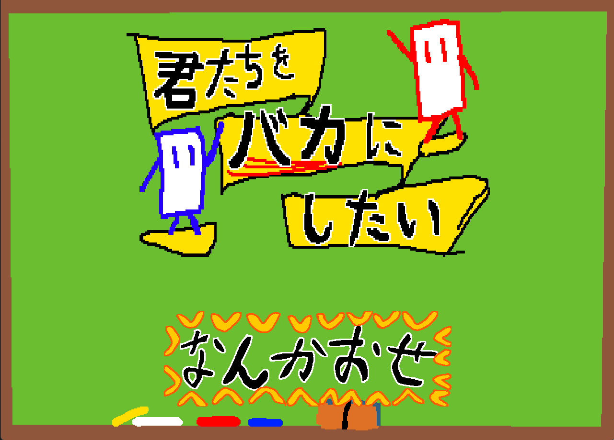

# 君たちを"バカ"にしたい

> 空から降ってくる武器を投げ合い、毎ラウンド変わる「妨害」に振り回されながら戦う、2人対戦ローカルアクションゲーム。

C++ / DxLib で個人開発した、Windows 向けの2人対戦ローカルアクションゲームです。

最大の特徴は、**毎ラウンド変化する15種類の「妨害（制限）」システム**。重力ゼロ、画面上下反転、隕石モード、加速＆反射……ラウンドごとに勝ち筋がまるごと入れ替わるので、上級者も初めての人も同じテーブルで盛り上がれます。

---

## このゲームの核：妨害（制限）システム

毎ラウンド、15種類の妨害から1つが発生します。設計でいちばん大事にしたのは、**どの妨害が来ても「理不尽」ではなく「楽しいカオス」になること**。種類ごとに専用の挙動を実装し、どれ1つでもゲームが成立して盛り上がるように作り分けました。

さらに、**同じ試合の中では一度出た妨害が二度と出ない**ようにして、毎ラウンド必ず新鮮な体験になるよう調整しています。

実装は **Strategy パターン**を採用。共通の抽象基底クラス `Restriction` を各妨害が継承し、新しい妨害は「クラスを1つ追加するだけ」で増やせる構成です。

> 設計の意図や工夫の詳細は **[アピール資料.md](アピール資料.md)** にまとめています。

---

## 遊び方

- プレイ人数：2人（ローカル対戦）
- 操作：キーボード / キーボード＋マウス / ゲームパッドに対応
- ルール：空から降ってくる武器を拾い、構えて投げ合う。**3ラウンド先取**で勝ち。

操作方法の詳細は [アピール資料.md の「操作方法」](アピール資料.md#操作方法) を参照してください。

---

## 動かし方（ビルド）

1. Visual Studio 2022 で `BakaNiShitai.sln` を開く
2. ソリューション構成を `x64`（Debug / Release どちらでも）にする
3. F5（ローカル Windows デバッガー）で実行

> ビルドには **DxLib** が必要です。あらかじめ DxLib を導入し、プロジェクトのインクルード／ライブラリパスを通してください。

---

## 使用技術

| 項目 | 内容 |
|------|------|
| 言語 | C++ |
| 開発環境 | Visual Studio 2022 |
| ライブラリ | DxLib（描画・入力・サウンド） |
| 対象プラットフォーム | Windows |
| 画面 | 1280 × 920 / 60FPS固定 |

採用した主なデザインパターン：**State**（シーン管理）・**Factory**（生成）・**Strategy**（妨害・アイテム）・**依存性注入**（リソース管理）。詳細は [アピール資料.md](アピール資料.md) を参照。

---

## 素材クレジット

- BGM：イワシロ音楽素材（https://iwashiro-sounds.work/ ）
- SE：Bfxr で自作（https://www.bfxr.net/ ）
